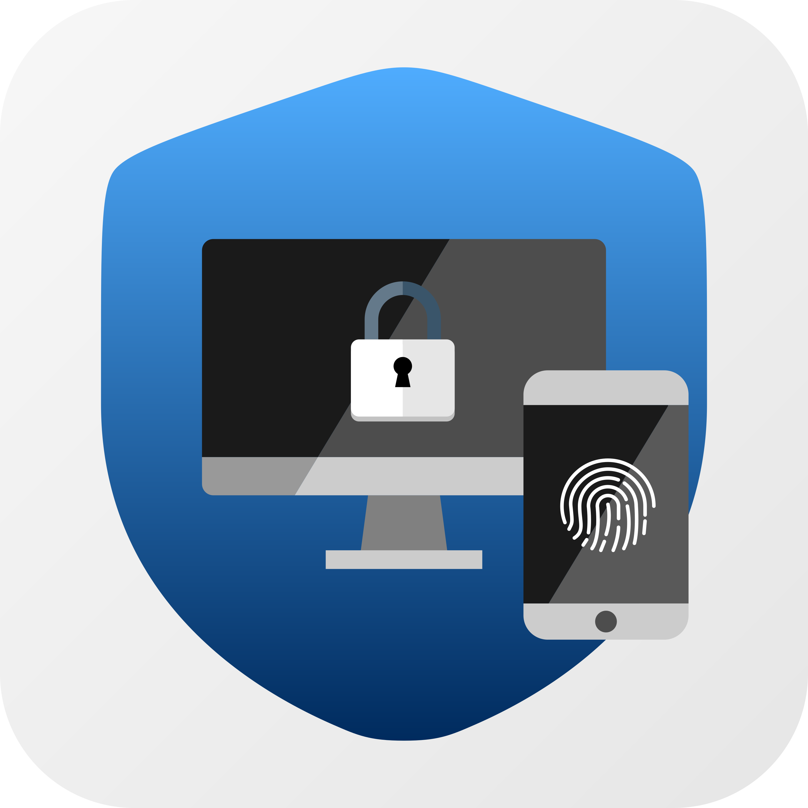

<p align="center">
  
</p>

<h1 align="center">✨ Portal-Windows ✨</h1>
<h3 align="center">🔮 Кодовое имя: <em>Herta</em> (v1.6.3) 🪄</h3>

<p align="center">
  <b>Бесшовная, безопасная и мгновенная разблокировка Windows с помощью вашего смартфона или умных часов</b><br>
  <i>Seamless, secure, and instantaneous Windows unlocking using your smartphone or smartwatch</i>
</p>

<p align="center">
  <a href="https://github.com/KoksMen/Portal-Windows/releases"></a>
  
  
  <a href="https://play.google.com/store/apps/details?id=com.xxmrk888ytxx.portal"></a>
  <a href="LICENSE.txt"></a>
</p>

<p align="center">
  <a href="#-portal-windows-на-русском"><b>🇷🇺 Перейти к русской версии</b></a> •
  <a href="#-portal-windows-in-english"><b>🇬🇧 Switch to English Version</b></a>
</p>

<p align="center">
  <a href="https://github.com/KoksMen/Portal-Windows/releases/latest">
    
  </a>
  <a href="https://play.google.com/store/apps/details?id=com.xxmrk888ytxx.portal">
    
  </a>
  <a href="https://github.com/xXMRK888YTXx/Portal-Android">
    
  </a>
</p>

---

# 🇷🇺 Portal-Windows (На русском)

## 💡 О проекте

**Portal-Windows** — это современная система биометрической аутентификации Windows (кастомный **Windows Credential Provider V2**), позволяющая моментально разблокировать компьютер или ноутбук с помощью вашего доверенного смартфона или умных часов.

Забудьте о рутинном и утомительном наборе длинных, сложных паролей на клавиатуре каждый раз при включении ПК или выходе из режима сна. Достаточно просто прикоснуться к сканеру отпечатка пальца на смартфоне или подтвердить действие на смарт-часах — и рабочий стол Windows мгновенно разблокируется! 🚀

> [!TIP]
> Система поддерживает не только локальный экран блокировки при входе в Windows, но и диалоговые окна **UAC (Контроль учетных записей)** для запуска приложений от имени администратора без ввода пароля вручную.

---

## 📱 Мобильное приложение (Mobile App)

Для работы с системой вам потребуется официальное клиентское приложение **Portal**:

| Канал загрузки | Ссылка | Описание |
| :--- | :--- | :--- |
| 🟢 **Google Play Store** | [**Установить из Google Play**](https://play.google.com/store/apps/details?id=com.xxmrk888ytxx.portal) | Официальный проверенный клиент для Android |
| 🐙 **GitHub (Android Client)** | [**xXMRK888YTXx/Portal-Android**](https://github.com/xXMRK888YTXx/Portal-Android) | Оригинальный репозиторий мобильного клиента и APK-файлы |
| ⌚ **Поддержка Wear OS** | Встроена в мобильный клиент | Разблокировка компьютера прямо с вашего запястья! |

### Возможности мобильного клиента:
- 👆 **Биометрия:** Поддержка отпечатка пальца (Touch ID / Fingerprint) и сканирования лица (Face Unlock).
- 📲 **Мгновенный запрос (Push / Direct Socket):** Уведомление о запросе на разблокировку появляется на экране телефона за доли секунды.
- 🧩 **Шторка быстрых настроек:** Быстрая плитка (Quick Settings Tile) в Android для разблокировки без открытия приложения.
- ⌚ **Часы Wear OS:** Подтверждение входа прямо с экрана ваших смарт-часов.
- 🔐 **Криптографическое хранение:** Приватные ключи и сертификаты надежно защищены аппаратным модулем Android KeyStore.

---

## 🌟 Ключевые возможности

### ⏳ 1. Живой динамический прогресс-бар и стили (NEW v1.6.3)
- **Прогресс-бар прямо в плитке пользователя:** Прямо под вашим аватаром отображается стильная шкала тайм-аута и таймер обратного отсчёта.
- **3 визуальных стиля:** блочный `[████]`, тонкий `[━━━━]` и точечный `[●●●●]` — настраиваются в один клик в параметрах приложения Host.
- **Кастомный текст статуса:** Возможность задать свою персонализированную фразу вместо стандартной «Ожидание подтверждения...». Шкала автоматически масштабируется под длину текста.
- **Идеальное нативное центрирование:** Статусный заголовок и полоса прогресса разнесены по отдельным системным COM-контролам LogonUI — текст всегда строго выровнен по центру контейнера плитки без смещений влево.
- **Адаптивная калибровка Segoe UI:** Длина шкалы рассчитана по реальным метрикам шрифта под жесткий контейнер DirectUI (~305 px) — полоса гармонично сочетается с текстом и никогда не обрезается.
- **Защита от переноса строк (No-Wrap):** Пробелы вокруг бейджей времени заменены на неразрывные (`\u00A0`), что исключает разрыв строки компонентами Windows.
- **Симметричный режим бесконечного ожидания:** При отключенном тайм-ауте отображается плавная бегущая волна (marquee) и симметричные бейджи бесконечности:
  ```text
  [█████████  1:44  ██████▒░░░]  <- Режим с тайм-аутом (динамическое центрирование)
  [██░░░░  (∞) 0:15 (∞)  ░░░░██]  <- Бесконечный режим (симметричный marquee)
  ```

### 🪟 2. Современный Windows 11 Fluent Design
- **Эффекты размытия Mica Alt & Acrylic:** Интерфейс десктопного приложения гармонично интегрируется с оболочкой Windows 11 через DWM API.
- **Автоматический fallback:** На Windows 10 активируется стильная контрастная тёмная тема.
- **Чёткая векторная графика (SVG & Segoe MDL2):** Векторные иконки устройств, статусов связи и элементов управления.

### 📡 3. Двойной канал связи (Wi-Fi + Bluetooth)
- 🚀 **Локальный mTLS WebSocket (по Wi-Fi / LAN):** Молниеносный обмен пакетами с минимальной задержкой (RTT < 15 мс).
- 📶 **Прямой Bluetooth RFCOMM канал:** Если домашний роутер выключен или пропал интернет, разблокировка продолжит работать по прямому каналу Bluetooth между телефоном и ПК.
- 📊 **Живой индикатор канала:** По кнопке «Подробности» на экране блокировки выводится текущий транспорт и IP-адрес.

### 🔍 4. Zero-Configuration & Zero-Setup (mDNS)
- Компьютер автоматически объявляет о себе в локальной сети по протоколу mDNS (`_portal._tcp.local.`).
- Смартфон моментально находит ПК сам — не нужно вручную узнавать и прописывать IP-адреса.

### 🌐 5. Динамическая сетевая адаптация (NEW v1.6.3)
- Интеграция с системным API `NetworkChange`.
- При переключении между сетями Wi-Fi, мобильной точкой доступа, кабелем Ethernet или VPN служба автоматически и бесшовно обновляет слушатели и переанонсирует mDNS-сервис.

### ⚡ 6. Интерактивная диагностика связи (Test Unlock Connection)
- В карточке сопряженного устройства доступна кнопка **«⚡ Проверить связь»**.
- Запускает временный mTLS-сервер, отправляет тестовый пинг на телефон и выводит точный замер Round-Trip Time (RTT задержка в миллисекундах).

### 📦 7. Сборка архива диагностики в один клик (NEW v1.6.3)
- В разделе **Настройки $\rightarrow$ Диагностика** добавлена кнопка **«Экспорт диагностического отчёта»**.
- Формирует единый защищённый ZIP-архив `portal-diagnostics-*.zip` со всеми логами, конфигурациями и сведениями о системе (без конфиденциальных данных и паролей).

### 🛡️ 8. Защита UAC и аварийный сброс (Emergency Cancel)
- Поддержка диалогов повышения прав администратора (Windows CredUI).
- Защита от зависаний: горячая клавиша аварийного сброса позволяет мгновенно вернуть стандартный ввод пароля.

### 🚀 9. Экстремальная производительность (ReadyToRun AOT & Tiered JIT)
- Модуль `Portal.CredentialProvider` компилируется в режиме AOT (Ahead-of-Time ReadyToRun).
- Экран входа Windows (`logonui.exe`) отрисовывает плитку Portal мгновенно и без малейших задержек.

### 🔍 10. Поиск и умная фильтрация журналов (NEW v1.6.3)
- Окно журналов `LogsWindow` оснащено строкой поиска и быстрыми чип-фильтрами: **«Все»**, **«Ошибки»**, **«Сеть (WS)»**, **«Bluetooth (BLE)»**.
- Мгновенная фильтрация в памяти без лагов дискового ввода-вывода и интерактивный счётчик совпадений.

### ⌨️ 11. Мгновенная клавиатурная навигация (NEW v1.6.3)
- **Повтор по Enter:** Нажатие клавиши <kbd>Enter</kbd> на плитке при пустом поле пароля моментально отправляет удалённый запрос на смартфон без мыши.
- **Умная авто-отмена:** Если пользователь начинает вводить пароль на клавиатуре руками, сетевой запрос мгновенно отменяется.

### 🛡️ 12. Валидация паролей и аудит безопасности LSA (NEW v1.6.3)
- Проверка пароля Windows в реальном времени через `LogonUserW` перед сохранением учетных данных.
- Фоновый аудит читаемости DPAPI/LSA секретов при каждом старте Host с бейджем `[⚠️ Ошибка секрета]` при обнаружении повреждений.

### 💾 13. Защищённое резервное копирование (.portalbackup AES-256-GCM)
- Встроенный экспорт и импорт полного профиля (настройки, доверенные устройства, сертификат хоста) в зашифрованный контейнер по алгоритму AES-256-GCM с PBKDF2 (210 000 итераций) и мастер-паролем.

---

## 🛡️ Архитектура безопасности

Безопасность ваших персональных данных — главный приоритет архитектуры Portal:

- 🔒 **Никаких паролей в открытом виде:** Учетные данные пользователя **не хранятся** в конфигурационных файлах или реестре. Для хранения используется защищенное системное хранилище **Windows LSA (Local Security Authority) Secret Store**, доступ к которому имеет исключительно процесс ядра операционной системы (`LocalSystem`).
- 🔐 **Взаимная аутентификация mTLS:** Все сетевые соединения защищены современными криптографическими протоколами TLS с обязательной валидацией отпечатков клиентских сертификатов.
- 🎯 **Строгая валидация RequestId:** Входящие команды подтверждения разблокировки валидируются по уникальным сессионным идентификаторам, что исключает replay-атаки (повторное воспроизведение перехваченных пакетов).
- 🤝 **Криптографическое сопряжение (Pairing Context):** Разблокировать систему может только то мобильное устройство, которое прошло авторизацию через защищённый QR-код.

---

## 🧩 Компоненты решения

```
┌────────────────────────────────────────────────────────────────────────┐
│                             Portal Solution                            │
├──────────────────────────┬─────────────────────────────────────────────┤
│ 🖥️ Portal.Host           │ Десктопное приложение WPF (Fluent UI,       │
│                          │ управление устройствами, QR-сопряжение)     │
├──────────────────────────┼─────────────────────────────────────────────┤
│ 🔑 Portal.Credential     │ Системный COM-провайдер V2 для интеграции   │
│    Provider              │ в экран входа Windows (LogonUI) и UAC       │
├──────────────────────────┼─────────────────────────────────────────────┤
│ 🔄 Portal.Updater        │ Модуль безопасного фонового обновления      │
│                          │ с проверкой цифровой подписи Authenticode   │
├──────────────────────────┼─────────────────────────────────────────────┤
│ 📦 Portal.Common         │ Общая библиотека криптографии, mDNS,        │
│                          │ сетевых протоколов и моделей данных         │
└──────────────────────────┴─────────────────────────────────────────────┘
```

---

## 🛠️ Установка и быстрый старт

### Требования к системе:
- **ОС:** Windows 10 (версия 1809+) или Windows 11 (любая редакция, x64).
- **Среда выполнения:** .NET 8.0 Desktop Runtime (включена в комплект или устанавливается автоматически).
- **Смартфон:** Android 8.0+ с камерой и биометрическим сканером.

---

### Пошаговая инструкция:

1. **Установите мобильное приложение:**
   - Скачайте клиент из [**Google Play**](https://play.google.com/store/apps/details?id=com.xxmrk888ytxx.portal) или установите APK из [репозитория Android](https://github.com/xXMRK888YTXx/Portal-Android/releases).
2. **Скачайте Portal-Windows:**
   - Перейдите в раздел [**Releases**](https://github.com/KoksMen/Portal-Windows/releases/latest) и скачайте архив `PortalWin-*-win-x64.zip`.
3. **Распакуйте и запустите:**
   - Распакуйте архив в удобную постоянную папку (например, `C:\Program Files\Portal` или в каталог профиля пользователя).
   - Запустите файл `Portal.Host.exe` от имени администратора.
4. **Активируйте службу:**
   - В открывшемся главном окне нажмите большую кнопку **«СТАРТ»**.
   - Приложение настроит системные правила брандмауэра и зарегистрирует COM-библиотеку провайдера.
5. **Подключите смартфон:**
   - Перейдите на вкладку **Устройства** и нажмите **«+ Добавить устройство»**.
   - На экране появится защищённый одноразовый QR-код.
   - Откройте приложение Portal на смартфоне, нажмите **«Сканировать QR-код»** и наведите камеру на монитор.
   - Задайте имя компьютеру — сопряжение завершено! 🎉
6. **Попробуйте в действии:**
   - Заблокируйте Windows комбинацией клавиш <kbd>Win</kbd> + <kbd>L</kbd>.
   - Вы увидите плитку Portal с живым прогресс-баром ожидания.
   - Прикоснитесь пальцем к сканеру на смартфоне — компьютер мгновенно разблокирован! 🪄✨

---

## 💻 Сборка из исходников

Для самостоятельной сборки проекта вам понадобятся:
- **Visual Studio 2022** (версия 17.8+) или **JetBrains Rider**, либо **.NET 8.0 SDK**.
- Установленная рабочая нагрузка **.NET Desktop Development** (WPF).
- PowerShell 7+ или Windows PowerShell 5.1.

### Шаги сборки:

```powershell
# 1. Клонирование репозитория
git clone https://github.com/KoksMen/Portal-Windows.git
cd Portal-Windows

# 2. Восстановление зависимостей
dotnet restore Portal-Windows.slnx

# 3. Сборка решения в конфигурации Release
dotnet build src/Portal.Host/Portal.Host.csproj -c Release

# 4. Публикация в каталог publish/
dotnet publish src/Portal.Host/Portal.Host.csproj -c Release -p:SkipSigning=true -o publish/
```

Готовые исполняемые файлы и компоненты провайдера учетных данных будут скомпилированы в каталоге `publish/`.

---

<br>

---

# 🇬🇧 Portal-Windows (In English)

## 💡 About the Project

**Portal-Windows** is a state-of-the-art Windows biometric authentication system (custom **Windows Credential Provider V2**) designed to effortlessly and securely unlock your PC or laptop using your trusted smartphone or smartwatch.

No more typing long, complex master passwords on your physical keyboard multiple times a day. Simply touch the fingerprint sensor on your phone or tap your smartwatch screen, and your Windows desktop unlocks instantaneously! 🚀

> [!TIP]
> The system seamlessly handles both standard Windows lock screens and elevated **User Account Control (UAC)** prompts, allowing you to approve administrator privileges right from your mobile device.

---

## 📱 Mobile App

To pair and unlock your PC, install the companion **Portal** mobile client:

| Source | Link | Description |
| :--- | :--- | :--- |
| 🟢 **Google Play Store** | [**Get it on Google Play**](https://play.google.com/store/apps/details?id=com.xxmrk888ytxx.portal) | Official production client for Android |
| 🐙 **GitHub (Android Source)** | [**xXMRK888YTXx/Portal-Android**](https://github.com/xXMRK888YTXx/Portal-Android) | Original mobile client repository & APK downloads |
| ⌚ **Wear OS Support** | Included in mobile app | Unlock your desktop straight from your wrist! |

### Mobile Client Highlights:
- 👆 **Biometric Authentication:** Support for fingerprint (Touch ID) and facial recognition (Face Unlock).
- 📲 **Instant Push / Direct Socket:** Immediate unlock prompt popup with ultra-low latency.
- 🧩 **Quick Settings Tile:** Unlock directly from the Android quick settings shade.
- ⌚ **Wear OS Watches:** Approve PC unlock requests directly on your smartwatch.
- 🔐 **Hardware-Backed Security:** Cryptographic private keys and certificates are safeguarded by Android KeyStore.

---

## 🌟 Key Features

### ⏳ 1. Live Dynamic Progress Bar & Styles (NEW v1.6.3)
- **Progress Bar on User Tile:** Beautiful real-time progress bar and countdown timer embedded directly into the Windows logon tile.
- **3 Visual Styles:** Block `[████]`, Thin `[━━━━]`, and Dots `[●●●●]`, configurable in one click in Host Settings.
- **Custom Status Headline:** Replace the default "Awaiting approval..." with your own custom phrase. The progress bar automatically adapts its width to fit.
- **Dead-Center Native Alignment:** Decoupled status headline and progress bar into dedicated LogonUI controls, guaranteeing pixel-perfect native DirectUI centering without any left-edge bias.
- **Calibrated Segoe UI Font Metrics:** Widths precisely adapted to fit the DirectUI container limit (~305 px) — guarantees the bar never clips or wraps.
- **Line-Wrap Protection (No-Wrap):** Non-breaking spaces (`\u00A0`) prevent Windows DirectUI from splitting the bar across lines.
- **Symmetric Infinite Wait Mode:** Ambient marquee wave with symmetric infinity badges on both sides of elapsed time:
  ```text
  [█████████  1:44  ██████▒░░░]  <- Countdown mode (centered dynamic fill)
  [██░░░░  (∞) 0:15 (∞)  ░░░░██]  <- Infinite mode (symmetric marquee)
  ```

### 🪟 2. Windows 11 Fluent Design
- **Mica Alt & Acrylic Backdrops:** Modern translucent desktop window effects utilizing native Windows 11 DWM APIs.
- **Automatic Fallback:** Clean, high-contrast dark theme on Windows 10.
- **Crisp Vector Graphics (SVG & Segoe MDL2):** Resolution-independent vector iconography for all devices, connectivity badges, and buttons.

### 📡 3. Dual-Channel Connectivity (Wi-Fi + Bluetooth)
- 🚀 **High-Speed mTLS WebSocket (Local Network):** Blazing-fast packet exchange with sub-15ms round-trip latency over local Wi-Fi / Ethernet.
- 📶 **Direct Bluetooth RFCOMM:** Direct duplex Bluetooth channel works flawlessly even when your Wi-Fi router is turned off or Internet is disconnected.
- 📊 **Live Transport Indicator:** Tile details view shows the active transport interface and local IP address.

### 🔍 4. Zero-Configuration & Zero-Setup (mDNS)
- Automatic local network computer announcement using multicast DNS (`_portal._tcp.local.`).
- Smartphone discovers your PC automatically without requiring static IP configuration.

### 🌐 5. Dynamic Network Adaptation (NEW v1.6.3)
- Powered by `System.Net.NetworkInformation.NetworkChange`.
- Smoothly switches active listeners and debounces mDNS re-advertisement when moving between Wi-Fi networks, mobile hotspots, Ethernet, or VPNs.

### ⚡ 6. Interactive Connection Diagnostics (Unlock Test)
- Dedicated **«⚡ Check Connection»** button on paired device cards.
- Deploys an ephemeral mTLS test listener, pings the mobile device, and displays accurate Round-Trip Time (RTT latency in milliseconds).

### 📦 7. One-Click Diagnostic ZIP Export (NEW v1.6.3)
- Under **Settings $\rightarrow$ Diagnostics**, click **«Export Diagnostic Report»**.
- Bundles host logs, provider logs, network interfaces, and environment telemetry into an archive (`portal-diagnostics-*.zip`) for easy troubleshooting.

### 🛡️ 8. UAC Elevation Support & Emergency Rollback
- Native elevation prompt handling via Windows CredUI.
- Built-in emergency cancel hotkey instantly restores standard password input if a mobile device is unreachable.

### 🚀 9. Instant LogonUI Rendering (ReadyToRun AOT & Tiered JIT)
- Ahead-of-Time (ReadyToRun) compilation enabled for `Portal.CredentialProvider`.
- Windows `logonui.exe` renders the tile instantly without JIT compilation pauses.

### 🔍 10. Search & Fast Filtering in Logs (NEW v1.6.3)
- Dedicated search box and category chip filters: **"All"**, **"Errors"**, **"Network (WS)"**, **"Bluetooth (BLE)"**.
- Instant in-memory search across logs without disk latency and real-time match counter.

### ⌨️ 11. Instant Keyboard Controls (NEW v1.6.3)
- **Retry on Enter:** Pressing <kbd>Enter</kbd> on an idle tile with an empty password field triggers an immediate remote unlock request without touching the mouse.
- **Smart Auto-Cancel:** Begins typing a physical password on the keyboard cancels the pending remote unlock request immediately.

### 🛡️ 12. Password Pre-Validation & LSA Auditing (NEW v1.6.3)
- Real-time Windows password validation via `LogonUserW` prevents storing incorrect passwords in the LSA Secret Store.
- Background LSA secret integrity check on Host startup shows an alert badge `[⚠️ Secret Issue]` on problematic device cards.

### 💾 13. Secure Encrypted Backups (.portalbackup AES-256-GCM)
- Export and import your entire profile (settings, paired devices, and host TLS certificate) in an AES-256-GCM encrypted package with PBKDF2 key derivation (210,000 iterations) and master password protection.

---

## 🛡️ Enterprise-Grade Security Architecture

- 🔒 **Zero Plaintext Credentials:** Passwords are **never** stored in config files, plain text, or registry. Secure **Windows LSA (Local Security Authority) Secret Store** is used exclusively, accessible only by the Windows kernel `LocalSystem` process.
- 🔐 **Mutual TLS (mTLS):** All network communications are encrypted with TLS 1.3/1.2 requiring mutual certificate validation.
- 🎯 **Strict RequestId Anti-Replay Validation:** Unlock tokens are bound to cryptographic, short-lived session request identifiers, preventing replay attacks.
- 🤝 **Pairing Cryptography:** Only explicitly paired devices possessing valid pairing context certificates can authorize unlock requests.

---

## 🧩 Solution Architecture

```
┌────────────────────────────────────────────────────────────────────────┐
│                             Portal Solution                            │
├──────────────────────────┬─────────────────────────────────────────────┤
│ 🖥️ Portal.Host           │ Desktop WPF application (Fluent UI, device  │
│                          │ management, QR pairing, diagnostics)        │
├──────────────────────────┼─────────────────────────────────────────────┤
│ 🔑 Portal.Credential     │ Native Windows COM V2 Credential Provider   │
│    Provider              │ embedded into LogonUI.exe and CredUI        │
├──────────────────────────┼─────────────────────────────────────────────┤
│ 🔄 Portal.Updater        │ Secure background updater with              │
│                          │ Authenticode digital signature validation   │
├──────────────────────────┼─────────────────────────────────────────────┤
│ 📦 Portal.Common         │ Shared crypto, mDNS, protocol specifications│
│                          │ and shared data contracts                   │
└──────────────────────────┴─────────────────────────────────────────────┘
```

---

## 🛠️ Quick Start Guide

### Prerequisites:
- **Operating System:** Windows 10 (1809+) or Windows 11 (all editions, x64).
- **Runtime:** .NET 8.0 Desktop Runtime (included in distribution package).
- **Mobile Device:** Android 8.0+ with camera and biometric scanner (fingerprint / face).

---

### Step-by-Step Setup:

1. **Install the Mobile Companion App:**
   - Get the app on [**Google Play**](https://play.google.com/store/apps/details?id=com.xxmrk888ytxx.portal) or download the APK from the [Android Repository](https://github.com/xXMRK888YTXx/Portal-Android/releases).
2. **Download Portal-Windows:**
   - Grab the latest `PortalWin-*-win-x64.zip` from [**Releases**](https://github.com/KoksMen/Portal-Windows/releases/latest).
3. **Extract & Launch:**
   - Extract to a permanent folder (e.g. `C:\Program Files\Portal`).
   - Run `Portal.Host.exe` as Administrator.
4. **Start the Service:**
   - Click the prominent **«START»** button on the dashboard to register the Credential Provider with Windows.
5. **Pair Your Device:**
   - Go to **Devices** tab and click **«+ Add Device»**.
   - A secure single-use QR code will be generated on your screen.
   - Open Portal on your smartphone, tap **«Scan QR Code»**, and scan your monitor.
   - Name your PC — pairing is complete! 🎉
6. **Experience the Magic:**
   - Lock Windows (<kbd>Win</kbd> + <kbd>L</kbd>).
   - See the live progress bar waiting for confirmation.
   - Tap your phone's fingerprint sensor — Windows unlocks instantly! 🪄✨

---

## 💻 Building from Source

### Build Steps:

```powershell
# 1. Clone repository
git clone https://github.com/KoksMen/Portal-Windows.git
cd Portal-Windows

# 2. Restore dependencies
dotnet restore Portal-Windows.slnx

# 3. Build Release
dotnet build src/Portal.Host/Portal.Host.csproj -c Release

# 4. Publish to publish/
dotnet publish src/Portal.Host/Portal.Host.csproj -c Release -p:SkipSigning=true -o publish/
```

The published binaries and Credential Provider COM registration components will be located in the `publish/` directory.

---

## 📄 License & Acknowledgments

This project is licensed under the terms of the **GNU General Public License v3.0 (GPL-3.0)**. See [LICENSE.txt](LICENSE.txt) for full details.

- Special thanks to the open-source community for **WPF-UI**, **QRCoder**, and **Makaretu.Dns**.
- Developed with ❤️ by [@KoksMen](https://github.com/KoksMen).
